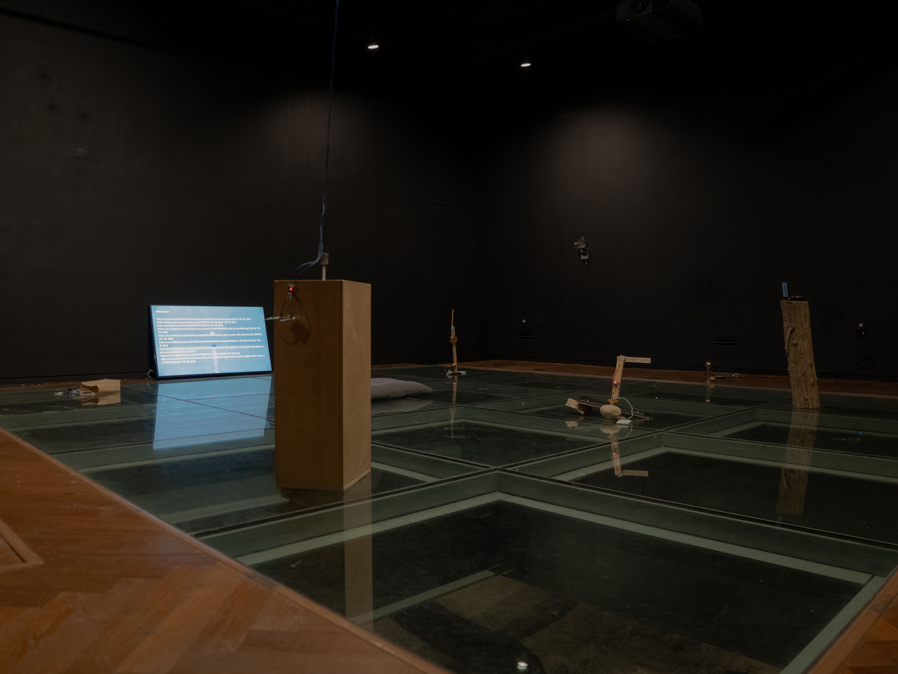

# *Ssang-Cha-Ssang-Jo 双遮双照 : The Dream of Rainbow* (2022)

Sound Installation Project / 소리 설치 프로젝트

 *Outputs* (2022)

Motors, Node MCUs, Woods, Broken Glasses, Glasses, Tape Player, Paper Bag, Threads, Thread Machine, Wooden Balls, Piano Sound Board, Speakers

*소리로 빚어내는 깨달음의 순간 가림과 동시에 비추는 것, ‘쌍차쌍조’*

소리의 다양한 결은 예술가의 손길을 거쳐 비로소 새로운 의미로 피어오른다. 때로는 소리가 갖는 고유의 속성을 파헤치면서, 때로는 소리에 새겨진 관념과 관행을 해체하면서 예술가는 소리와 맞닿은 세계를 고유의 상상력으로 비추어 낸다.

 
임희주 작가는 청각을 불쾌하게 하는 소리, 시끄러운 소리, 신경을 건드리는 소리, 혼란을 야기하는 소리, 그로인해 배제되고 소외되어 온 소리인 ‘소음’에 천착한다. 누구나 불편해 하는 소음은 작가에게 창작의 원동력이자 내면을 비추고 깨달음을 얻어내는 힘이다. 소리의 경계에서, 소음이 갖는 소외적인 측면은 그로 하여금 무엇인가를 발언할 수 있는 강력한 도구가 된다.

 

작가가 통찰한 소음은 비체(abject)적 존재다. 끊임없이 들리지만 간과되는 존재, 어디나 있지만 드러내지 않는 존재, 누구나 불편해 하는 존재, 경계를 규정할 수 없는, 혹은 경계를 흐리는 존재, 그래서 경계 바깥으로 내던져진, 타자화의 존재라는 의미다. 그렇기에 오히려 소음은 동일화를 거부하고 질서와 체계, 또는 그것을 작동시키는 권력을 전복한다.

 

소음의 청각 경험은 강력하다. 보고 싶지 않는 것은 눈꺼풀로 가릴 수 있건만 들려오는 소리는 거부하거나 차단할 수 없다. 귀를 막아도 피부를 뚫고 온몸을 울리며 파고든다. 소리는 모든 방향에서 듣는 이의 몸에 와 닿으며 내면으로 침투한다. 이러한 청각의 속성은 소리의 강제적 수신을 전제한다. 같은 맥락에서 『음악 혐오』의 저자 파스칼 키냐르(Pascal Quignard)는 “듣는다는 것은 순종적 행위”라고 말한다. “귀 기울임은 복종”이라는 것이다.  

 

인간은 모태에서부터 죽음의 순간에 이르기까지 단 한순간도 쉬지 않고 무엇인가를 듣는다. 귀에는 차단장치가 없기 때문에 그것을 거부하지도 막아내지도 못한다. 이렇게 무조건적으로 받아들일 수밖에 없는 청각의 특성은 때로는 고통을 수반한다. 한 공간 안에서 지속되는 소리, 자율적으로 차단하기 어려운 크고 거친 소리, 통제와 질서를 벗어난 파괴적인 소리, 이러한 소리는 고통을 일으키는 소음으로 간주된다. 소음은 온 몸으로 스며들어 듣는 이를 꼼짝 못하게 하며 마침내 그것에 굴복당해 스스로를 희생하도록 만든다.

 

임희주 작가는 소음이라는 청각 요소를 이용해 ‘쌍차쌍조’의 깨달음을 풀어낸다. 소리와 소음을 이용해 두 귀를 ‘쌍차’하는 청각 환경을 조성하고 존재자, 즉 관람객은 소음을 전유하며 소리의 통제 불가능성을 몸소 체험하도록 설계한다. 전시장에 설치된 오브제들로부터 끊임없이 들려오는 소음은 관람객의 청각을 사로잡고 온몸을 에워싼다. 그 소음을 오롯이 수용하면서 관람객은 그 안에 매몰된다. 지속적인 소리가, 그리고 소음이 외부 세계로부터의 차단과 단절을 유도하는 것이다. 소리에 파묻혀 외부 세계로부터 단절되는 경험은 동시에 온전히 내면을 비추는, ‘쌍조’의 단계로 나아간다. 서로를 막아 차단하고 서로를 비추어 비로소 드러나게 한다는 ‘쌍차쌍조’의 역설적 상태와 같이 그 소리 경험은 궁극적으로 존재의 참다운 모습으로 거듭나는 중도의 과정일 수 있다. 외적 현실을 가리고 내면의 진정한 모습으로 거듭나는 변화일 수 있다. 이는 작가에 의해 섬세하게 설계된 가상의 예술 공간에서 소리와 소음의 청취를 통해 은유적으로 구현된다.

 

또한 임희주 작가는 소음이 빚어내는 제의적 측면에 주목한다. 바타유(Georges Bataille)의 ‘희생제의’ 개념을 소음과 청취의 본질적 특성에 연결지어 해석한다. 소음은 내면에 도사리는 폭력성과 과잉에너지를 소비하도록 만드는 소리 매체다. 작가는 전시장의 영상과 소리 오브제의 총체적 디자인을 통해 자극적인 소음을 지속적으로 노출시키거나, 극단의 침묵과 과잉의 소음을 대치시켜 이를 고스란히 두 귀로, 온몸으로 받아들이게 하는 일종의 청각적 자학을 재현한다. 가상의 청각 재현을 경험함으로써 관람객은 스스로 희생되는 제의의 주체가 되어 본다. 작가는 제의의 샤먼처럼, 주술적 행위를 대신하며 그 과정을 돕는다. 작가의 전시 공간에서 이 과정은 그 자체가 고행이고 수행인 것이다. 특정 신을 위한 수행이 아니라 개인의 내면, 그리고 자아의 성찰을 위한 깨달음의 과정인 셈이다. 소리로 빚어내는 그 깨달음의 순간은 작가의 깊은 고민과 사유와 만나는 지점이기도 하다.

 
글 | 김경화 음악학자

